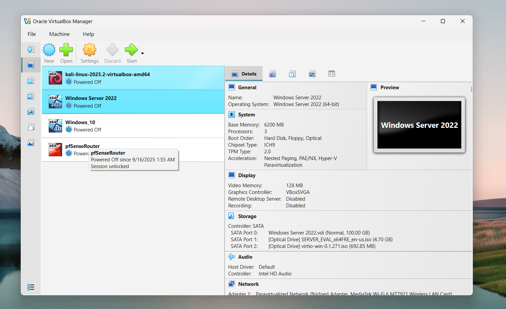
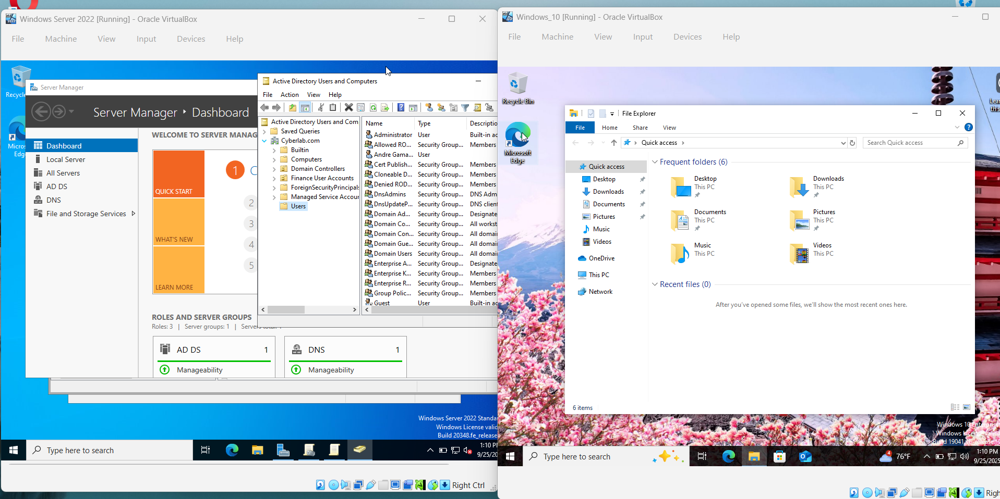
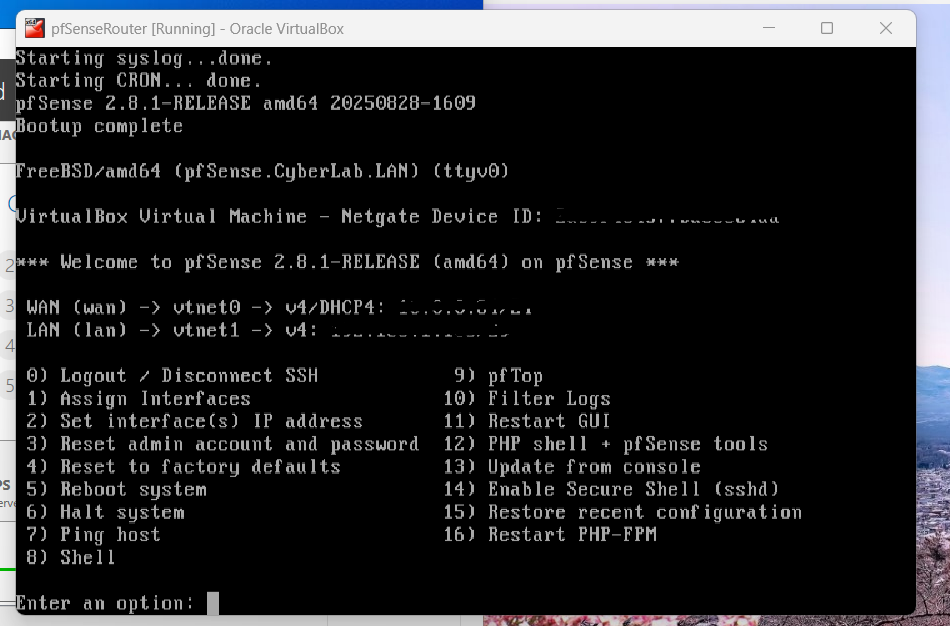
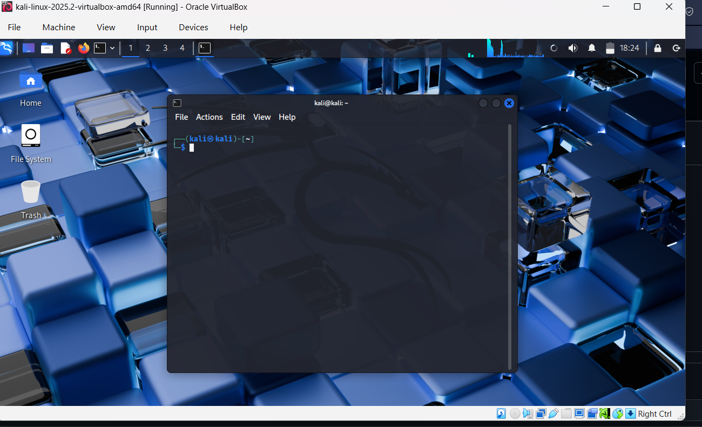

# Cyber Home Lab 🕵️ — pfSense + Windows Server 2022 + Windows 10 + Kali

### Goal:
Reproducible, isolated home cyber lab for learning defensive and offensive techniques. Primary VMs:

* **pfSense —** virtual router/firewall (LAN = isolated lab network; WAN = NAT or bridged to host)

* **Windows Server 2022 —** Active Directory Domain Controller (AD DS), DNS optional

* **Windows 10 —** domain-joined workstation

* **Kali Linux —** attacker machine on isolated attacker VLAN

## Planned next steps: 
* Wazuh (SIEM), Sysmon (host EDR telemetry), Wireshark, Snort/Suricata, and controlled attacks from Kali to exercise detections

## Table of Contents
- [VirtualBox Setup](vbox-setup.md)
- [pfSense Setup](pfSense-setup.md)
- [Active Directory Deployment](ad-deploy.ps1)
- [Observability (Sysmon + Wazuh)](observability/agent-installation.md)
- [Attack Playbooks (Kali Recon)](attack-playbooks/kali-basic-recon.md)
- [Security Disclaimer](SECURITY.md)
  

## Screenshots

### VirtualBox Overview
* Shows the VM setup (pfSense, Windows Server 2022, Windows 10, Kali Linux).

### Active Directory on Windows Server 2022
* Windows Server 2022 with Active Directory Users and Computers open, alongside a Windows 10 client.

### pfSense WebGUI
* pfSense dashboard showing configured interfaces and firewall settings.

### Kali Linux
* A display of my openned Kali Linux.

